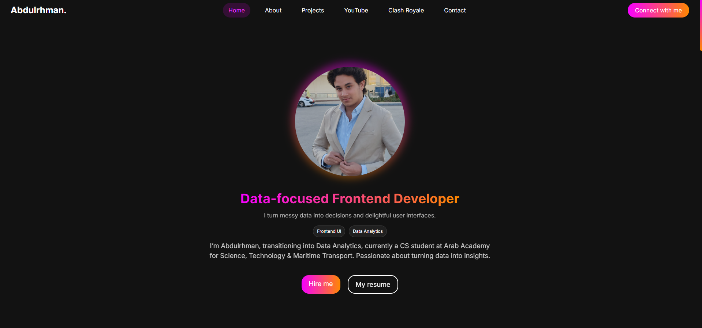
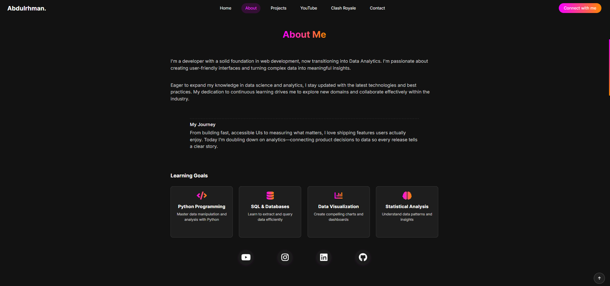
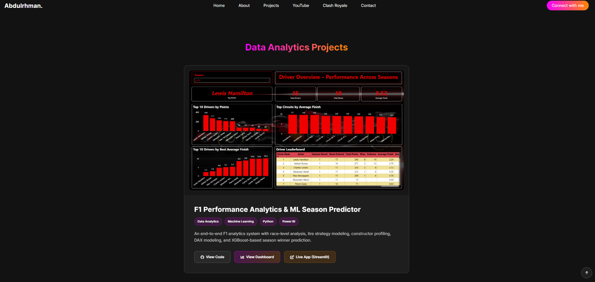

## Abdulrhman Mohamed — Data‑focused Frontend Developer 👨‍💻📊

> I turn messy data into decisions and delightful UIs. ✨

<style>
/* Modern gradient background matching website */
body {
    background: #121212;
    min-height: 100vh;
    margin: 0;
    padding: 20px;
    font-family: 'Inter', system-ui, -apple-system, Segoe UI, Roboto, Arial, sans-serif;
}

/* Container with glassmorphism effect matching website theme */
.readme-container {
    background: rgba(18, 18, 18, 0.95);
    backdrop-filter: blur(20px);
    border-radius: 20px;
    border: 1px solid rgba(246, 0, 255, 0.3);
    padding: 40px;
    margin: 0 auto;
    max-width: 1200px;
    box-shadow: 0 25px 45px rgba(246, 0, 255, 0.1);
}

/* Enhanced images with hover effects */
img {
    border-radius: 15px;
    box-shadow: 0 8px 25px rgba(0, 0, 0, 0.2);
    transition: all 0.4s cubic-bezier(0.175, 0.885, 0.32, 1.275);
    filter: brightness(0.9);
}

img:hover {
    transform: translateY(-8px) scale(1.02);
    box-shadow: 0 20px 40px rgba(0, 0, 0, 0.3);
    filter: brightness(1.1);
}

/* Gradient text for main title matching website */
h1 {
    background: linear-gradient(90deg, rgba(246,0,255,1) 0%, rgba(255,136,0,1) 100%);
    background-size: 300% 300%;
    -webkit-background-clip: text;
    -webkit-text-fill-color: transparent;
    background-clip: text;
    animation: gradient-shift 3s ease infinite, float 6s ease-in-out infinite;
    font-size: 2.5em;
    text-align: center;
    margin-bottom: 20px;
    position: relative;
}

@keyframes float {
    0%, 100% { transform: translateY(0px); }
    50% { transform: translateY(-10px); }
}

@keyframes gradient-shift {
    0%, 100% { background-position: 0% 50%; }
    50% { background-position: 100% 50%; }
}

/* Enhanced headings matching website */
h2, h3 {
    background: linear-gradient(90deg, rgba(246,0,255,1) 0%, rgba(255,136,0,1) 100%);
    -webkit-background-clip: text;
    -webkit-text-fill-color: transparent;
    background-clip: text;
    border-left: 4px solid rgba(246,0,255,1);
    padding-left: 15px;
    margin-top: 30px;
}

/* Beautiful quote styling matching website */
blockquote {
    background: linear-gradient(135deg, rgba(246, 0, 255, 0.1), rgba(255, 136, 0, 0.1));
    border-left: 5px solid rgba(246, 0, 255, 1);
    padding: 20px;
    border-radius: 10px;
    margin: 20px 0;
    font-style: italic;
    position: relative;
}

blockquote::before {
    content: '"';
    font-size: 4em;
    color: rgba(246, 0, 255, 1);
    position: absolute;
    top: -10px;
    left: 10px;
    opacity: 0.3;
}

/* Enhanced links matching website */
a {
    color: rgba(246, 0, 255, 1);
    text-decoration: none;
    padding: 5px 10px;
    border-radius: 20px;
    transition: all 0.3s ease;
    background: rgba(246, 0, 255, 0.1);
}

a:hover {
    background: rgba(246, 0, 255, 0.2);
    transform: translateY(-2px);
    box-shadow: 0 5px 15px rgba(246, 0, 255, 0.3);
}

/* Social links row */
.social-links {
    text-align: center;
    margin: 30px 0;
    padding: 20px;
    background: rgba(255, 255, 255, 0.05);
    border-radius: 15px;
    border: 1px solid rgba(255, 255, 255, 0.1);
}

.social-links a {
    display: inline-block;
    margin: 0 10px;
    padding: 12px 20px;
    background: linear-gradient(90deg, rgba(246,0,255,1) 0%, rgba(255,136,0,1) 100%);
    color: white;
    border-radius: 25px;
    font-weight: 500;
    transition: all 0.3s ease;
}

.social-links a:hover {
    transform: translateY(-3px);
    box-shadow: 0 10px 25px rgba(246, 0, 255, 0.4);
}

/* Enhanced lists */
ul, ol {
    background: rgba(255, 255, 255, 0.05);
    padding: 20px 40px;
    border-radius: 15px;
    border: 1px solid rgba(255, 255, 255, 0.1);
    margin: 20px 0;
}

/* Preserve emoji rendering - keep original shape and style */
li strong {
    font-family: inherit;
    font-weight: bold;
}

/* Let browser handle emojis naturally - no font overrides */
/* This ensures emojis display in their original, natural form */

li {
    margin: 10px 0;
    padding: 8px 0;
    border-bottom: 1px solid rgba(255, 255, 255, 0.1);
}

li:last-child {
    border-bottom: none;
}

/* Code blocks */
code, pre {
    background: rgba(0, 0, 0, 0.3);
    color: #4ecdc4;
    padding: 15px;
    border-radius: 10px;
    border: 1px solid rgba(255, 255, 255, 0.1);
    font-family: 'Fira Code', monospace;
}

/* Horizontal rules matching website */
hr {
    border: none;
    height: 2px;
    background: linear-gradient(90deg, transparent, rgba(246,0,255,1), transparent);
    margin: 40px 0;
}

/* Highlights section matching website */
.highlights {
    background: linear-gradient(135deg, rgba(246, 0, 255, 0.1), rgba(255, 136, 0, 0.1));
    padding: 30px;
    border-radius: 20px;
    border: 1px solid rgba(246, 0, 255, 0.3);
    margin: 30px 0;
}

/* Tech stack badges matching website */
.tech-badge {
    display: inline-block;
    background: linear-gradient(90deg, rgba(246,0,255,1) 0%, rgba(255,136,0,1) 100%);
    color: white;
    padding: 8px 16px;
    border-radius: 20px;
    margin: 5px;
    font-size: 0.9em;
    font-weight: 500;
}

/* Responsive design */
@media (max-width: 768px) {
    .readme-container {
        padding: 20px;
        margin: 10px;
    }
    
    h1 {
        font-size: 2em;
    }
    
    .social-links a {
        display: block;
        margin: 10px 0;
    }
}

/* Smooth scrolling */
html {
    scroll-behavior: smooth;
}

/* Custom scrollbar matching website */
::-webkit-scrollbar {
    width: 8px;
}

::-webkit-scrollbar-track {
    background: rgba(18, 18, 18, 0.8);
    border-radius: 10px;
}

::-webkit-scrollbar-thumb {
    background: linear-gradient(90deg, rgba(246,0,255,1) 0%, rgba(255,136,0,1) 100%);
    border-radius: 10px;
}

::-webkit-scrollbar-thumb:hover {
    background: linear-gradient(90deg, rgba(255,136,0,1) 0%, rgba(246,0,255,1) 100%);
}
</style>

<div class="readme-container">

<div class="social-links">
<a href="/index.html">🌐 Portfolio</a> • <a href="./CV.pdf">📄 Resume</a> • <a href="https://www.youtube.com/@YeagX">▶️ YouTube</a> • <a href="https://www.linkedin.com/in/ayeager13/">🔗 LinkedIn</a> • <a href="https://github.com/AYeagerr">🐙 GitHub</a>
</div>

---

### Highlights ✨

<div class="highlights">
<ul>
<li><strong>Modern hero ✨</strong>: Gradient‑ring avatar, crisp typography, focused value prop</li>
<li><strong>Micro‑interactions 🎛️</strong>: Smooth GSAP + ScrollTrigger animations across sections</li>
<li><strong>YouTube integration 📺</strong>: Latest video + 3 recent uploads via RSS, "NEW" badge, channel logo fetch</li>
<li><strong>Projects grid 🧩</strong>: Hover lift, clean CTAs to Live Demo and Code</li>
<li><strong>Clash Royale spotlight 👑</strong>: Personal stats, deck cards with elixir badges, favorite card highlight</li>
<li><strong>Zero‑backend contact ✉️</strong>: Validated form submitting to Google Forms with a custom success popup</li>
<li><strong>Performance‑minded 🚀</strong>: Lazy-loaded images/iframe, skeleton placeholders, lightweight vanilla JS</li>
</ul>
</div>

---

## Demo ▶️

- Open `index.html` directly, or run a static server:
```bash
# VS Code (Live Server extension)
# Click "Go Live"

# npx (Node)
npx serve .

# Python
python -m http.server 8080
```

---

## Tech Stack 🧰

- **Core 🧱**: <span class="tech-badge">HTML5</span> <span class="tech-badge">CSS3</span> <span class="tech-badge">Vanilla JS</span>
- **Libraries 📚**: <span class="tech-badge">GSAP</span> <span class="tech-badge">ScrollTrigger</span> <span class="tech-badge">Bootstrap 5</span> <span class="tech-badge">Font Awesome</span>
- **Fonts 🔤**: <span class="tech-badge">Inter</span> <span class="tech-badge">Luckiest Guy</span>
- **Integrations 🔌**:
  - YouTube via RSS (`js/youtube-rss.js`) [default] 📡
  - Optional YouTube Data API (`js/youtube-api.js`) 🔑
  - Google Forms for contact submissions (`js/google-form-handler.js`) ✉️

---

## Features in Detail 🔍

- **GSAP-powered flow 🎬**
  - Animated nav, hero reveal, section entrances, hover scaling on projects, footer fade‑in
  - Active nav link syncing while scrolling

- **YouTube section 📺**
  - Embeds the latest upload and shows 3 recent videos with thumbnails
  - Auto “NEW” badge for uploads within 7 days
  - Fetches channel avatar from RSS with graceful fallback

- **Projects 🧩**
  - Curated cards with images for IGYM, ARIA, and Red E‑commerce
  - Buttons for “Live Demo” and “Code” open in new tabs

- **Clash Royale corner ⚔️**
  - Profile stats, achievements chips, last updated date
  - Deck with card art, elixir badges, and golden highlight for favorite card

- **Contact 📬**
  - Client-side validation (name/email/message)
  - No backend needed — submits to Google Forms
  - Animated “Message Sent!” popup with auto‑dismiss and ESC/overlay close

---

## Quick Start 🚀

```bash
git clone <REPO_URL>
cd Portfolio
# open index.html or start a local server
```

File structure:
```
Portfolio/
  CSS/                # Sectioned styles (nav, hero, about, projects, youtube, clash-royale, contact, footer)
  Images/             # Avatar, project images, Clash Royale cards, favicon
    cards/            # Deck card art and metadata
  js/
    animations.js     # GSAP + ScrollTrigger animations and interactions
    youtube-rss.js    # RSS-based YouTube integration (default, no API key)
    youtube-api.js    # Optional YouTube Data API integration (requires API key)
    google-form-handler.js # Validations + Google Forms submit + success popup
  index.html
  CV.pdf
```

---

## Configuration ⚙️

### YouTube (RSS — default, no API key) 📡
- Already enabled via `js/youtube-rss.js`. It:
  - Fetches latest upload + recent videos
  - Sets channel avatar from RSS
  - Uses a CORS proxy (`api.allorigins.win`) for the feed

### YouTube (Data API — optional) 🔑
1. Get an API key from Google Cloud Console.
2. In `js/youtube-api.js`, set:
   - `this.apiKey = 'YOUR_API_KEY_HERE'`
   - `this.channelId = 'YOUR_CHANNEL_ID'`
3. In `index.html`, replace the RSS script with the API script:
```html
<!-- Remove -->
<script src="js/youtube-rss.js"></script>
<!-- Add -->
<script src="js/youtube-api.js"></script>
```

### Contact (Google Forms) ✉️
- In `js/google-form-handler.js`, update:
  - The form action to your form: `https://docs.google.com/forms/d/e/<YOUR_FORM_ID>/formResponse`
  - `GOOGLE_FORM_ENTRIES` to match your form field entry IDs
- Works without any server; all client‑side.

---

## Customize 🎨

- **Branding**: Update name, tagline, and avatar in `index.html`
- **Colors/Type**: Tune palettes in `CSS/main.css` and section styles
- **Socials**: Edit links in the `About` section
- **Projects**: Replace images in `Images/` and update links/titles under `#projects`
- **Clash Royale**: Swap images in `Images/cards/` and adjust stats/deck labels

---

## Screens 🖼️





---

## Deployment 🚀

- **GitHub Pages**: Settings → Pages → Deploy from Branch → `main` → `/root`
- **Vercel / Netlify**: New Project → Import repo → Framework: Static site → Deploy

---

## Accessibility & Performance ♿⚡

- Lazy `loading="lazy"` and `decoding="async"` on media
- Responsive layout with Bootstrap grid + custom CSS
- Keyboard/overlay dismiss on the popup
- Fallback content for YouTube and avatar fetching

---


## License 📄

Copyright © 2025 Abdulrhman Mohamed.

Assets and trademarks for Clash Royale belong to Supercell. External libraries remain under their respective licenses.

---

## Contact 📬

- Email: abdulrhman.mohamed026@gmail.com
- Phone: +201023232234
- Cairo, Egypt
- YouTube: @YeagX
- LinkedIn: /in/ayeager13/
- GitHub: @AYeagerr

</div>
